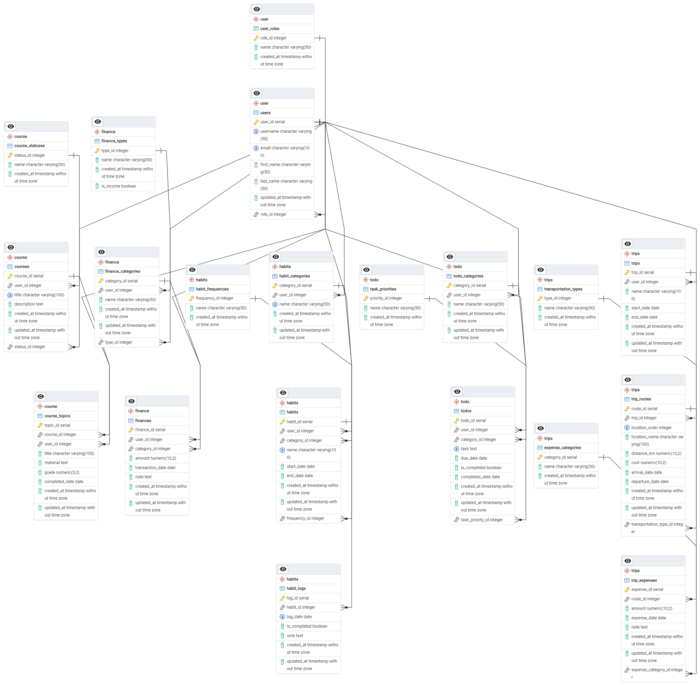

# Personal Database Management System

A fully‑structured PostgreSQL 16+ database designed to manage and analyze multiple aspects of personal life — from education and finances to habits, tasks, and travel — with automation, data integrity checks, and analytics views.

## ⚡ Quickstart for Reviewers (20 seconds)

One command validates everything:

**Windows:**
```powershell
powershell scripts/validate_all.ps1
```

**macOS/Linux:**
```bash
bash scripts/validate_all.sh
```

**What it checks:**
1. ✅ `schema.sql` matches source dump
2. ✅ Schema imports cleanly into PostgreSQL
3. ✅ 68 pgTAP unit tests pass


## 🗂️  Modular Schema Design

Organized into dedicated schemas for scalability and clarity:

- course – Managing courses and learning topics - `courses`- `course_topics`- `course_statuses`
- finance – Tracking income and expenses `finances`, `finance_categories`, `finance_types`
- habits – Tracking habits and categories (tables: `habits`, `habit_categories`, `habit_logs`).
- todo – Managing tasks and task categories (tables: `todos`, `todo_categories`, `task_statuses`, `task_priorities`).
- trips – Planning trips, routes, and expenses (tables: `trips`, `trip_routes`, `trip_expenses`).

## ⚙️ Intelligent Features

Triggers and functions are used for automatic updates of statuses, data correctness, and dates:

- `update_course_status` — Updates the course status when topics are modified.
- `check_finance_amount` — Validates the correctness of amounts for incomes and expenses.
- `set_completed_date` — Automatically sets the completion date for tasks.
- `update_updated_at` — Updates the `updated_at` field when changes occur.

## 📊 Built‑In Analytics Views

- `course_progress` — Monitor learning milestones.
- `financial_summary` — Monthly income/expense breakdown.
- `course_grades` — Consolidated academic performance.
- `trip_costs` — Expense tracking per trip.


## 🚀 Quick Start (Default: English-Clean Schema)

1. Deploy the database in PostgreSQL version 16 or higher.
2. Run the schema-only SQL script (English-clean, no sample data):
   ```bash
   psql -U your_user -d your_db -f schema.sql
   ```

### Full Dump with Sample Data (Optional)

For the complete dump including sample data:
```bash
psql -U your_user -d your_db -f "Personal base.sql"
```

See `docs/TRANSLATION_NOTES.md` for details on the English-clean default.

### Regenerating schema.sql

`schema.sql` is generated deterministically from `Personal base.sql` by stripping data sections:

**Windows:**
```powershell
powershell scripts/generate_schema.ps1
```

**macOS/Linux:**
```bash
bash scripts/generate_schema.sh
```

The generator:
- Removes `INSERT INTO` data statements
- Removes `SELECT pg_catalog.setval()` sequence resets
- Keeps all DDL (CREATE, ALTER, COMMENT ON, indexes, constraints, functions, views)
- Verifies output contains no Cyrillic

CI will fail if `schema.sql` is out of sync with the source dump:
```bash
bash scripts/check_schema_up_to_date.sh
```

## Requirements

- PostgreSQL 16 or higher
- psql command-line tool

## ✅ One-Command Validation

Validate that the SQL imports cleanly:

**Windows:**
```powershell
powershell scripts/validate.ps1
```

**macOS/Linux:**
```bash
bash scripts/validate.sh
```

**Validate full dump with sample data:**
```bash
bash scripts/validate.sh --with-data
```

**With Docker (recommended):**
```bash
docker-compose up -d
bash scripts/validate.sh --cleanup
```

The validation script uses `ON_ERROR_STOP=on` so any SQL error fails fast. By default, it validates the English-clean `schema.sql`.

## 🧪 Unit Tests (pgTAP)

The repository includes comprehensive pgTAP unit tests that validate schema structure:

- **01_schemas.pg** - All 6 schemas exist
- **02_tables.pg** - Anchor tables in each schema exist
- **03_columns.pg** - Critical columns with correct data types
- **04_constraints.pg** - Primary keys and foreign keys present
- **05_indexes.pg** - Indexes on key tables
- **06_functions.pg** - Trigger functions and triggers installed
- **07_views.pg** - Analytics views exist and are queryable

**Run locally:**

Windows:
```powershell
powershell scripts/run_pgtap.ps1
```

macOS/Linux:
```bash
bash scripts/run_pgtap.sh
```

**CI Pipeline includes:**
1. Cyrillic character scan
2. Schema import validation (smoke tests)
3. Invalid object check
4. **pgTAP unit tests**

## 🔒 CI Pipeline

CI automatically runs the same validation as `validate_all` on every push and PR:
1. Cyrillic character scan
2. Schema drift check
3. Schema import validation
4. Invalid object check
5. pgTAP unit tests (68 assertions)

## 📦 What's Included

| File/Folder | Purpose |
|-------------|---------|
| `schema.sql` | **Default schema** (English-clean, no data) |
| `"Personal base.sql"` | Full dump with sample data (optional) |
| `scripts/validate_all.*` | One-command validation |
| `tests/pgtap/` | 68 pgTAP unit tests |
| `.github/workflows/ci.yml` | GitHub Actions CI |
| `ER.png` | Visual ER diagram (may drift) |

## 📊 ER Diagram

`ER.png` is a visual aid for understanding table relationships:



**Note:** ER.png may drift from the actual schema. The authoritative sources are:
- `schema.sql` - DDL source of truth
- `tests/pgtap/*.pg` - 68 structure assertions

## Documentation

- `docs/ARCHITECTURE.md` - Schema design & validation overview
- `docs/REVIEWER_NOTES.md` - Quickstart for reviewers
- `docs/TRANSLATION_NOTES.md` - schema.sql vs full dump explanation
- `CONTRIBUTING.md` - PR requirements
- `scripts/schema_smoke_tests.sql` - Additional validation queries
